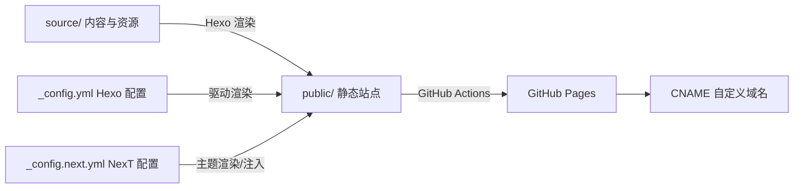

# EternalPneuma.github.io

这是一个基于 [Hexo](https://hexo.io/) + [NexT](https://theme-next.js.org/) 的静态博客源码仓库：
内容源文件位于 `source/`，站点配置位于 `_config.yml` / `_config.next.yml`，
由 GitHub Actions 自动生成 `public/` 并部署到 GitHub Pages（自定义域名见 `CNAME`）。

## 快速开始

### 环境要求

- Node.js：建议使用 18（与 CI 一致，见 `.github/workflows/deploy.yml`）
- npm：随 Node.js 安装

### 安装依赖

```bash
npm ci
```

### 本地预览

```bash
npm run server
```

默认会启动本地服务（通常为 `http://localhost:4000`）。

### 构建静态站点

```bash
npm run build
```

构建产物输出到 `public/`（已在 `.gitignore` 中忽略，不直接提交到仓库）。

### 清理缓存与产物

```bash
npm run clean
```

## 项目架构

### 生成链路（从源码到线上）



### 分层与职责

- 内容层（Content）：`source/` 下的 Markdown、页面与静态资源，决定站点内容与素材。
- 配置层（Config）：`_config.yml`（Hexo 全局配置）与 `_config.next.yml`（NexT 主题配置），决定站点路由、渲染行为与主题能力开关。
- 主题扩展层（Theme Customization）：`source/_data/` 下的模板注入与样式覆盖，作为 NexT 的定制扩展点。
- 构建与发布层（CI/CD）：`.github/workflows/deploy.yml` 负责自动构建并发布到 GitHub Pages。

## 目录结构

```text
.
├── _config.yml                # Hexo 主配置（站点信息/URL/主题/渲染等）
├── _config.next.yml           # NexT 主题配置（推荐使用 Alternate Theme Config）
├── package.json               # 依赖与脚本（build/clean/deploy/server）
├── scaffolds/                 # Hexo 模板（新建文章/页面/草稿）
├── source/
│   ├── _posts/                # 博客文章（Markdown）
│   ├── tags/                  # Tags 页面定义
│   ├── _data/                 # NexT 自定义注入与样式覆盖（见下文）
│   ├── fonts/                 # 本地字体资源（在样式中引用）
│   └── snow.js                # 前端雪花特效脚本（由模板注入加载）
└── .github/workflows/deploy.yml  # GitHub Pages 自动部署
```

## 主要模块与职责

### Hexo 配置（`_config.yml`）

- 站点元信息：标题、作者、语言、时区等。
- URL 与路由：`url`、`permalink`、`tag_dir` 等影响生成路径。
- 渲染与写作：Markdown 渲染器（marked）、代码高亮（highlight.js）等。
- 主题选择：`theme: next`。
- 部署：`deploy.type` 当前为空；线上发布由 GitHub Actions 完成。

### NexT 主题配置（`_config.next.yml`）

- `custom_file_path`：声明从 `source/_data/` 注入自定义模板与样式：
  - `head: source/_data/head.njk`
  - `bodyEnd: source/_data/body-end.njk`
  - `style: source/_data/styles.styl`
- 主题外观：`scheme: Gemini`、暗色模式开关等。
- 站点功能：本地搜索（`local_search.enable: true`）、Mermaid（`mermaid.enable: true`）等。

### 主题自定义注入（`source/_data/`）

- `head.njk`：在 `<head>` 阶段同步执行，强制设置为暗色主题（同时写入 `localStorage`，以匹配 NexT 的色彩方案读取逻辑）。
- `body-end.njk`：在页面末尾加载 `/snow.js`，用于雪花特效。
- `styles.styl`：Stylus 样式覆盖，包含本地字体 `@font-face`、正文排版、标题/引用/表格/Tag cloud 等视觉统一。

## 关键脚本、类与函数说明

仓库中“可执行代码”主要集中在雪花特效脚本 `source/snow.js`（以 IIFE 自执行模块形式存在），其余部分以配置与模板为主。

### `source/snow.js`（雪花特效模块）

核心思路：创建全屏 `canvas` 作为覆盖层（`pointer-events:none`），
以 `requestAnimationFrame` 驱动粒子更新与绘制；并在页面隐藏时暂停动画以节省资源；
关闭时支持 “drain” 模式，等粒子自然飘出屏幕后再移除画布。

- `rand(min, max)`：生成 `[min, max)` 随机浮点数。
- `createSnowflake(width, height, layer, randomY)`：创建单个粒子对象（位置/半径/透明度/速度/横向漂移等）。
- `initSnowflakes(width, height)`：按三层参数（dust/mid/large）初始化粒子数组，
  并按透明度排序以减少 `fillStyle` 切换。
- `updateAndDraw(time)`：每帧更新位置、回收或跳过粒子（draining 时不再回收）、批量绘制并在 draining 完成后触发清理。
- `resizeCanvas()`：将画布尺寸同步到窗口尺寸。
- `startAnimation()` / `stopAnimation()`：开始或停止 RAF 循环。
- `handleVisibilityChange()`：监听 `visibilitychange`，在后台暂停、回到前台恢复。
- `enable()`：创建 canvas、初始化粒子、注册 `resize` 与 `visibilitychange` 监听并启动动画。
- `disable()`：进入 draining 模式（不立即移除画布）。
- `finalizeDrain()`：drain 完成后的资源清理（移除事件监听、移除 canvas、释放上下文与粒子）。
- `forceDisable()`：立即清理（用于 `beforeunload` 等场景）。

## 依赖关系与插件清单

依赖统一由 `package.json` 管理，分为 Hexo 核心、主题与功能插件三类：

- Hexo 核心：`hexo`、`hexo-server`
- 生成器：`hexo-generator-index` / `archive` / `category` / `tag`、`hexo-generator-searchdb`
- 渲染器：`hexo-renderer-marked`、`hexo-renderer-ejs`、`hexo-renderer-stylus`
- 主题：`hexo-theme-next`（实际使用），`hexo-theme-landscape`（依赖保留但未启用）
- 内容增强：
  - 数学公式：`hexo-filter-mathjax`
  - Mermaid：`hexo-filter-mermaid-diagrams`
  - 字数统计：`hexo-word-counter`
  - 地图：`hexo-tag-leaflet` + `leaflet`

依赖关系（配置驱动）：

- `_config.yml` 通过 `theme: next` 选择主题。
- `_config.next.yml` 通过 `custom_file_path` 将 `source/_data/*.njk` 与
  `source/_data/styles.styl` 注入到主题渲染流程。
- `source/_data/body-end.njk` 通过 `<script src="/snow.js">` 引入 `source/snow.js`（构建后位于站点根路径）。
- `source/_data/styles.styl` 通过 `/fonts/...` 引用 `source/fonts/` 下的字体文件。

## 内容编写与发布流程

### 新建文章/页面

使用 Hexo 命令（会读取 `scaffolds/` 下模板）：

```bash
npx hexo new post "my-title"
npx hexo new page "about"
```

文章会生成到 `source/_posts/`，页面会生成到 `source/<page>/index.md`。

### 发布到线上（GitHub Pages）

push 到 `main` 分支会触发 GitHub Actions：

1. `npm ci`
2. `npx hexo g` 生成静态站点到 `public/`
3. 上传 `public/` 并通过 `actions/deploy-pages` 发布到 GitHub Pages

工作流定义见：`.github/workflows/deploy.yml`。

## 维护提示

- 站点构建产物 `public/` 不进版本控制；如需排查生成结果，优先本地运行 `npm run build` 后查看 `public/`。
- `source/snow.js` 与 `source/_data/snow.js` 当前存在两份同名脚本；
  线上实际加载路径由 `source/_data/body-end.njk` 决定（`/snow.js`），
  通常对应 `source/snow.js` 的构建结果。若要避免歧义，建议后续仅保留一处并统一引用路径。
